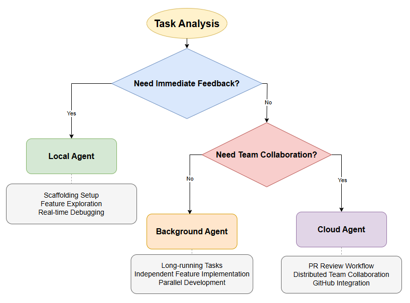
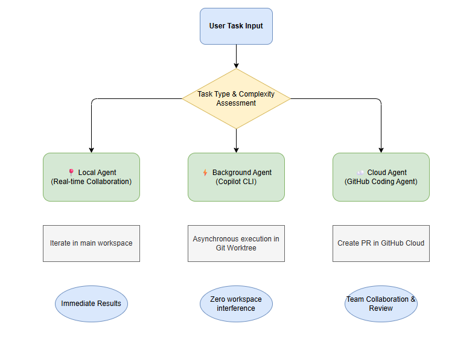

# Hands-On Tutorial

This article walks through both the theoretical architecture and hands-on practice of three core modes (Local / Background / Cloud). Starting from scratch, we'll build a Todo application and progressively add a theme switcher and a layout redesign.

## Theoretical Architecture

In GitHub Copilot, an Agent is no longer just a passive assistant that responds to instructions — it is an intelligent collaborative developer capable of **actively understanding requirements, executing multi-step tasks, and coordinating changes across files**.

There are currently three Agent modes:




A comparison of the three Agent modes is as follows:

| Feature | Local Agent | Background Agent (Copilot CLI) | Cloud Agent |
| :--- | :--- | :--- | :--- |
| **Runtime Environment** | VS Code main workspace | Local Git Worktree | GitHub remote infrastructure |
| **Interaction Style** | Real-time, synchronous | Asynchronous, background execution | Asynchronous, GitHub-based |
| **Best Use Cases** | Scaffolding, feature exploration, live debugging | Isolated tasks, long-running tasks | Team collaboration, tasks requiring PR review |
| **Conflict Risk** | Directly modifies main branch | **Isolated changes**, no conflicts | Creates separate branches and PRs |
| **Best Examples** | Creating new components, interactive refactoring | Adding theme switching, performance optimization | Redesigning layout, fixing complex bugs |


## Prerequisites

1. **Install VS Code** (version 1.96.1 or higher)
2. **Have a GitHub account** and a **Copilot subscription**
3. **Ensure Agent mode is enabled**:
   - Check that the setting `chat.agent.enabled` is set to `true` (enabled by default)
   - Organization users need to contact their admin to enable this feature

## Running Locally

The Local Agent is suited for **interactive tasks**, typically used for immediate feedback and results, such as project scaffolding or feature iteration.

Create a new directory, for example `todo-app`, and open it in VS Code.

Then open the Chat view (`Ctrl+Cmd+I` / `⌃⌘I`), select the built-in `Agent` and the `Local` mode.

Enter the following prompt:

```
Create a simple Todo application using HTML, CSS, and JavaScript.
Include an input field to add todos, a list to display them, and a delete button for each item.
```

After pressing Enter, the Agent will start selecting tools locally and creating the todo items. After a moment, the Agent completes the task and generates three files. Click the **Keep** or **Undo** button to control the changes.


The result looks like this:


> After installing the [Live Preview](vscode:extension/ms-vscode.live-server) extension (by Microsoft), click the Preview button in the top-right corner of the editor to preview the page inside VS Code.

::: details Summary

The Local Agent runs in your workspace's main branch, and modifications are real-time and visible. This mode allows us to:

- **Intervene instantly**: Provide feedback at any point during Agent execution
- **Validate incrementally**: Every change can be immediately previewed and tested
- **Iterate quickly**: Ideal for creative tasks that require repeated adjustments and experimentation

When building the Todo application, we may want to tweak the color scheme, layout, or interaction logic. The Local Agent's real-time interaction makes this kind of collaboration highly efficient.

:::

## Running in the Background

The Background Agent (Copilot CLI) is suited for **independent, result-oriented tasks**. It works asynchronously without interrupting your main workflow.

Let's try the CLI mode and select the Plan Agent to have it help us with planning.

> First, commit your current changes to ensure a clean workspace. Then open a new session window.

In the `Agent` list, select `Plan`, change the run mode to `Copilot CLI`, then enter the following prompt:

```
Create a plan to add a dark/light theme toggle feature to the application.
The toggle should switch between themes and persist the user's preference.
```

You will see an isolation mode selection:


- `Worktree isolation`:
  - In this mode, VS Code creates a *Git worktree* in a **separate folder** outside your project.
  - All read and write operations happen in this new folder. Your current code and running tests are completely unaffected.
  - Once the CLI finishes its work, if you are satisfied with the changes, you can merge them into your project's main branch.
  - This mode requires your project to be a Git repository.
- `Workspace isolation`:
  - Applies changes *directly* to the current workspace.
  - The agent operates in-place within the current workspace.

Let's try the Worktree approach. After pressing Enter, the result looks like this:


You can see that the Plan Agent created a new branch based on the current UTC time: `copilot/worktree-2026-04-01T06-40-54`. After reviewing our code, it produced a plan.

Now click **Start Implementation**.

Copilot CLI will then make code changes in the new branch. The completed result looks like this:


Click the **View All Changes** button next to the Apply button to see what changes were made in that branch:


Once you click **Apply**, the changes will be applied to the main workspace.

> Using `Git Worktree` to isolate changes means multiple background tasks can **run in parallel without conflicts**, allowing you to continue developing other features on the main branch.


::: details Summary

Copilot CLI mode is suited for independent, result-oriented background tasks. It executes asynchronously and never blocks your main workflow.

The prerequisite is that the project must be a Git repository and the current code must be committed (clean workspace).

:::


## Running in the Cloud

The Cloud Agent (Copilot Coding Agent) is suited for **team collaboration scenarios**. It is an AI agent that runs on remote compute resources and delivers code via GitHub PRs. It is typically used to offload tasks like large-scale refactoring or UI overhauls — tasks that don't require immediate feedback — to the cloud, without consuming local compute or IDE resources.

First, push the project to GitHub.

Then open a new chat window and enter the following prompt:

```
Redesign the Todo application layout to improve the user experience.
Update the colors, spacing, typography, and add animations to give it a modern look.
```

Remember to change the run mode to Cloud:


The Agent works on GitHub infrastructure, creating branches and PRs. In the chat session, you can click the GitHub PR link to track progress.

The result looks like this:


When the Agent completes the task, it will assign the PR to you for review. You can choose **Checkout** or **Apply** to merge the changes back into the main branch:


The final optimized result looks like this:


::: details Summary

The Cloud mode is primarily used to automatically create branches and submit Pull Requests, integrating AI-generated code into the existing GitHub Code Review workflow for human review and team collaboration.

:::

In addition, enterprise or organization administrators can manage the Cloud Agent through the following:

- **Enable/Disable third-party Agents**: Control the use of third-party agents such as Claude and Codex in Copilot account settings
- **Configure MCP servers**: Extend external tool capabilities for the Coding Agent
- **Set up a proxy firewall**: Control the resources the Agent can access and modify
- **Monitor usage**: View Agent activity logs and consumption metrics via organization settings

These management features ensure the safety and controllability of AI-assisted development in enterprise environments.

## Practical Recommendations

Based on your specific scenario and requirements, the following decision path is generally recommended:


