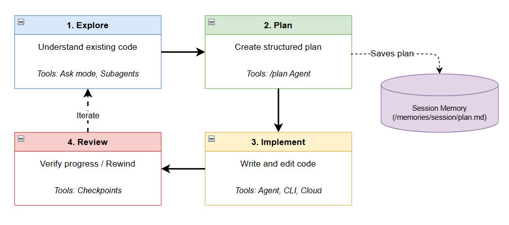
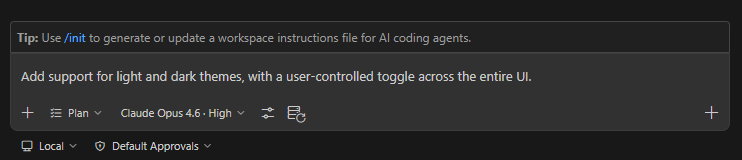
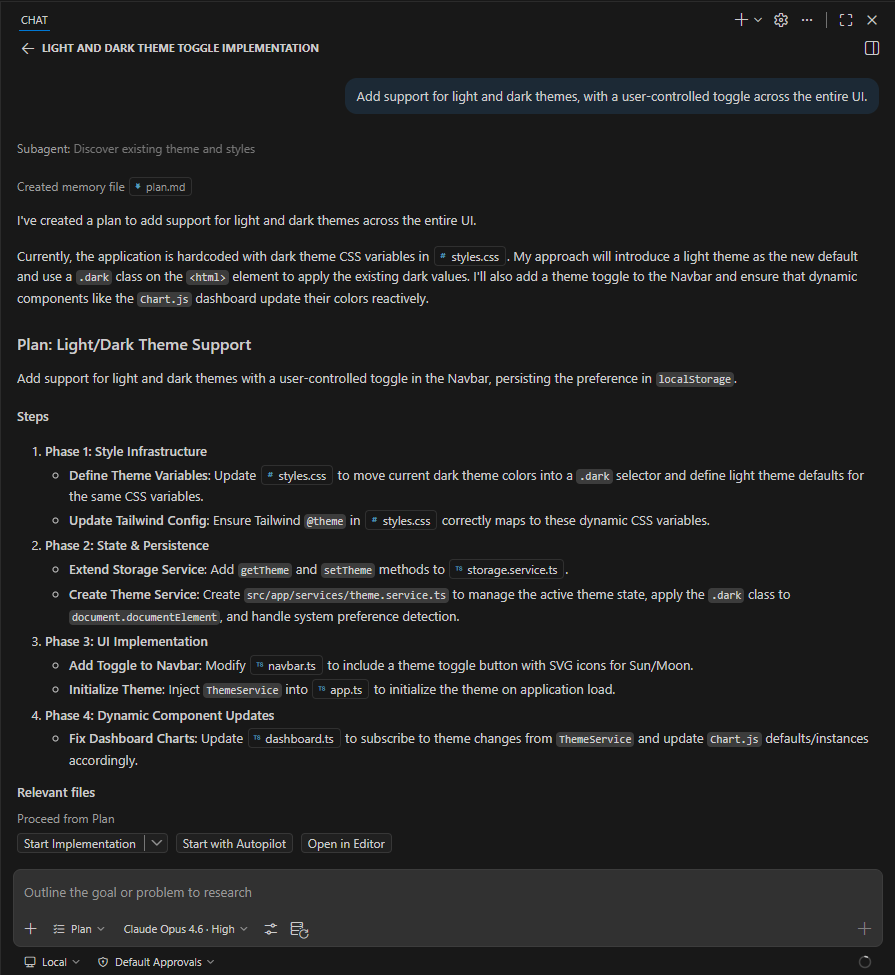
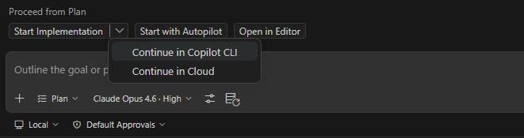
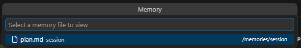

# Planning

The Plan agent enables you to create detailed implementation plans before writing code. Planning first ensures all requirements are met and prevents the AI from solving the wrong problem.

## Plan-First Workflow

## How to Use the Plan Agent

GitHub Copilot includes a built-in Plan Agent for generating plans, breaking tasks into subtasks, coordinating workflows, and ultimately providing an executable plan.

Open the chat view (<kbd>Ctrl+Alt+I</kbd>), select **Plan**, and then enter your requirements.

> You can also use the `/plan` command followed by your requirements to automatically switch to Plan mode.

For example:

At this point, the agent will first review the current project context and implementation, then may ask you some clarifying questions. Answer truthfully.

After running, it will provide you with a complete plan, including a high-level overview, implementation steps, and verification steps.

Finally, click `Start Implementation` to execute the plan.

> Once the plan is finalized, you can also click the button next to `Start Implementation` to expand two additional options: hand off to Copilot CLI or a cloud agent:
>
> 

::: tip
Type `/plan` followed by a task description to switch to Plan mode in one step.
:::

## Session Memory

If you look closely, you can see that in the above conversation, the Plan Agent automatically saved the current plan to a session memory file (`/memories/session/plan.md`).

You can open the command palette `Ctrl + Shift + P`, select `Chat: Show Memory Files` to view the current memory file list:

> Note: Memory files are scoped to each conversation.

## Customizing Planning

We can define default models for Plan mode, including:

- Planning model: Set using [chat.planAgent.defaultModel](vscode://settings/chat.planAgent.defaultModel).
- Implementation model: Set using [github.copilot.chat.implementAgent.model](vscode://settings/github.copilot.chat.implementAgent.model).

Through [github.copilot.chat.planAgent.additionalTools](vscode://settings/github.copilot.chat.planAgent.additionalTools), you can add access to MCP servers or other tools for Plan mode.

Furthermore, you can create a [custom planning agent](../customization/custom-agents.md) with specific project architecture guidelines and instructions.

## References

- [Planning with agents](https://code.visualstudio.com/docs/copilot/agents/planning)
- [Context engineering guide](https://code.visualstudio.com/docs/copilot/guides/context-engineering-guide)
