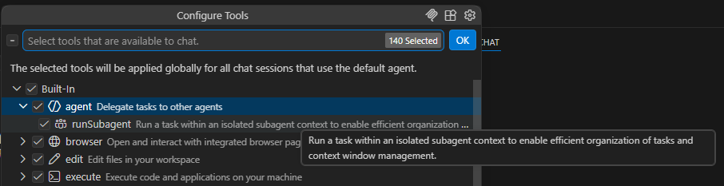

# Subagents

## What is a Subagent?

GitHub Copilot in VS Code introduces a **Multi-Agent** development mode, where Copilot is no longer just a "single chat assistant," but can work collaboratively like a real development team.

A **Subagent** refers to an independent agent with context isolation that performs focused work (research, analysis, review). It runs in an **independent context window**, receiving only the necessary subtask information, and finally reports the results back to the main agent. This allows the main agent to continue working without the main context being polluted by intermediate thinking processes, numerous tool calls, or research details.

In Copilot Chat, they are displayed as **collapsible tool calls** (collapsed by default; click to expand to see the full prompt, all tool calls, and returned results).

## Core Value

The benefit of this approach is that multiple independent subtasks can **run simultaneously**, significantly reducing wait times. it solves the problems of context window explosion and "thinking pollution."

It supports complex workflows: Research → Planning → Implementation → Multi-perspective Review, which improves development efficiency.

## How Subagents Work

From the default configuration, we can see that built-in agents have `runSubagent` permissions:



When an agent receives a complex task, the main agent identifies subtasks suitable for isolation and then starts a subagent, passing in the minimum necessary context. The subagent then works autonomously in its own context window (can use tools, search the codebase, call the web, etc.).

Finally, the subagent returns a research summary, and the main agent continues executing the task.

::: info Note

Subagents **do not inherit** the main agent's Memory by default (but can be explicitly requested to read it via prompts).

They are displayed as **collapsible tool calls** in the chat (click to expand to see the full prompt, tool calls, and results).

:::

## Usage Scenarios

::: details Case 1: Isolated Research + Recommended Solution
**Scenario**: Researching a new feature while avoiding pollution of the main context.

**Prompt**:
```
Perform isolated research on Node.js OAuth 2.0 implementation patterns,
using subagents to compare three solutions: passport.js, Auth0, and custom implementation.
Compare them with the current codebase and output the recommended solution along with a table of pros and cons.
```

**Actual Process**:
- The main agent automatically starts 1 subagent.
- The subagent independently researches, analyzes code, and calls tools like `search/codebase`.
- Returns a concise table → The main agent uses it directly for subsequent implementation.
- A collapsible card appears in the chat; click to view the subagent's full thinking process.
:::

::: details Case 2: Parallel Multi-dimensional Code Analysis
**Scenario**: A comprehensive scan before refactoring.

**Prompt**:

```
Perform a refactoring opportunity analysis on the current codebase, using subagents to execute the following tasks in parallel:
1. Find duplicate code patterns
2. Identify unused exports and dead code
3. Check error handling consistency
4. Scan for security vulnerabilities (OWASP Top 10)

Finally, summarize into a prioritized Markdown action plan.
```

**Effect**: 4 subagents **run simultaneously**, significantly reducing wait time. The main agent receives a complete plan and can execute it directly or delegate further implementation.
:::

::: details Case 3: Decision Making with Multi-solution Comparison
**Scenario**: Hesitating over an API caching solution.

**Prompt**:
```
I need to implement caching for this API. Use three subagents to research the following solutions in parallel:
1. Redis distributed cache
2. In-memory LRU cache
3. Layered hybrid cache (In-memory + Redis)

Compare performance, cost, maintainability, and compatibility with the project's current tech stack. Finally, recommend the best solution and provide implementation steps.
```

**Benefits**: Prevents the main agent from repeatedly weighing options in a single context, leading to more objective output.
:::


## Nested Subagents

By default, subagents cannot generate further subagents. Enable this via [`chat.subagents.allowInvocationsFromSubagents`](vscode://settings/chat.subagents.allowInvocationsFromSubagents) (maximum depth: 5).

## References

- Official Documentation: [Subagents in Visual Studio Code](https://code.visualstudio.com/docs/copilot/agents/subagents)
- Official Concepts: [Agents concepts - Subagents](https://code.visualstudio.com/docs/copilot/concepts/agents)
- 2026 Update Blog: [Parallel Subagents & Agentic Improvements](https://code.visualstudio.com/blogs/2026/01/parallel-subagents)
- Community Templates: [github/awesome-copilot](https://github.com/github/awesome-copilot)

## How Subagents Work (Legacy)

```
Main Agent
  ├─→ Subagent A (research)    → returns summary
  ├─→ Subagent B (analysis)    → returns findings
  └── continues with results from A and B
```

1. The main agent recognizes a part of the task that benefits from isolation.
2. It starts a subagent, passing only the relevant subtask.
3. The subagent works autonomously in its own context window.
4. The subagent returns a summary to the main agent.
5. The main agent incorporates the result and continues.

## Usage Scenarios (Legacy)

- **Research before implementation** — delegate investigation to a subagent before making changes
- **Parallel code analysis** — analyze multiple files or modules simultaneously
- **Explore multiple solutions** — each subagent explores a different approach
- **Code review with specialized focus** — security, performance, correctness reviews in parallel

## Invoking Subagents

Subagents are typically **agent-initiated** — the main agent decides when to use them. Make sure the `runSubagent` tool is enabled.

You can hint at subagent use in your prompts:

```
Perform isolated research about the auth patterns used in this project,
then implement the changes based on the findings.
```

### In Prompt Files

Include the `agent` tool in your prompt file:

```markdown
---
name: document-feature
tools: ['agent', 'read', 'search', 'edit']
---
Run a subagent to research the feature details,
then update the docs/ folder with new documentation.
```

## Custom Agents as Subagents

Custom agents can be used as subagents with their own model, tools, and instructions:

```
Run the Research agent as a subagent to research the best auth methods.
```

### Controlling Invocation

Two frontmatter properties control how agents can be invoked:

| Property | Default | Effect |
|---|---|---|
| `user-invocable` | `true` | Controls visibility in the agents dropdown |
| `disable-model-invocation` | `false` | Prevents invocation as a subagent |

To create a subagent-only agent (hidden from dropdown):

```markdown
---
name: internal-helper
user-invocable: false
---
This agent can only be invoked as a subagent.
```

### Restricting Available Subagents

Use the `agents` property to control which subagents are available:

```markdown
---
name: TDD
tools: ['agent']
agents: ['Red', 'Green', 'Refactor']
---
1. Use the Red agent to write failing tests
2. Use the Green agent to implement code to pass
3. Use the Refactor agent to improve code quality
```

## Orchestration Patterns

### Coordinator and Worker

A coordinator agent manages the task and delegates to specialized workers:

```markdown
---
name: Feature Builder
tools: ['agent', 'edit', 'search', 'read']
agents: ['Planner', 'Implementer', 'Reviewer']
---
1. Use the Planner agent to break down the feature
2. Use the Implementer agent to write the code
3. Use the Reviewer agent to check the implementation
```

### Multi-Perspective Code Review

Run each review perspective as a parallel subagent for independent, unbiased findings:

```markdown
---
name: Thorough Reviewer
tools: ['agent', 'read', 'search']
---
Run these subagents in parallel:
- Correctness reviewer: logic errors, edge cases
- Security reviewer: injection risks, data exposure
- Architecture reviewer: design consistency

Synthesize findings into a prioritized summary.
```

## Nested Subagents

By default, subagents cannot spawn further subagents. Enable with `chat.subagents.allowInvocationsFromSubagents` (max depth: 5).

## References

- [Subagents in VS Code](https://code.visualstudio.com/docs/copilot/agents/subagents)
- [Custom agents](https://code.visualstudio.com/docs/copilot/customization/custom-agents)
