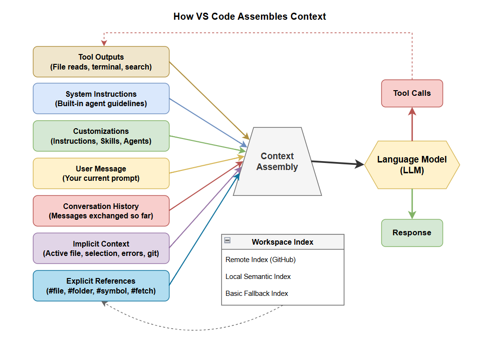

# Context

Context is everything the model can see when generating a response. The model can only reason about what it receives — everything outside the context window is invisible. Providing relevant context is one of the most effective ways to improve AI responses.

## Why Context Matters

A prompt with relevant files, clear instructions, and focused history produces better results than a vague prompt with no context. The model has no memory of previous sessions and no access to files it hasn't been given.

## How VS Code Assembles Context

When you send a message, VS Code builds a prompt from multiple sources:



## Types of Context

### Implicit Context

VS Code automatically provides:

- The currently selected text in the active editor
- The file name of the active editor
- In **Ask** mode, the active file is automatically included
- In **Agent** mode, the agent decides if the active file is relevant

### Explicit References

Use `#` mentions to add specific context:

- `#file:path/to/file.ts` — include a specific file
- `#folder:src/` — include a folder
- `#symbol:MyClass` — include a symbol definition
- `#fetch <url>` — fetch and include web content

### Workspace Indexing

VS Code maintains an index for searching your codebase:

- **Remote index** — for GitHub-hosted repos, enables fast cross-repo search
- **Local index** — advanced semantic index stored on your machine
- **Basic index** — simpler fallback algorithms for large codebases

## Working Effectively with Context

- **Start new sessions for new tasks.** Don't reuse one conversation for unrelated tasks.
- **Be selective.** Adding your entire codebase isn't always helpful. Reference specific files.
- **Use custom instructions for persistent rules.** They're included in every request, so you don't lose them when conversation is summarized.
- **Use `/compact`** to selectively compress context and retain only relevant information.

### Examples

**Vague prompt (poor context):**
```
How does authentication work?
```
→ Generic answer about authentication patterns.

**Prompt with explicit context:**
```
How does authentication work for this project?
```
→ The model reads your actual auth files and explains your implementation.

**Prompt with web context:**
```
Migrate the auth module to the latest passport.js API #fetch https://www.passportjs.org/concepts/authentication/
```
→ Uses current web documentation to guide the migration.

## References

- [Context concepts](https://code.visualstudio.com/docs/copilot/concepts/context)
- [Add context to chat](https://code.visualstudio.com/docs/copilot/chat/copilot-chat-context)
- [Workspace indexing](https://code.visualstudio.com/docs/copilot/reference/workspace-context)
- [Context engineering guide](https://code.visualstudio.com/docs/copilot/guides/context-engineering-guide)
