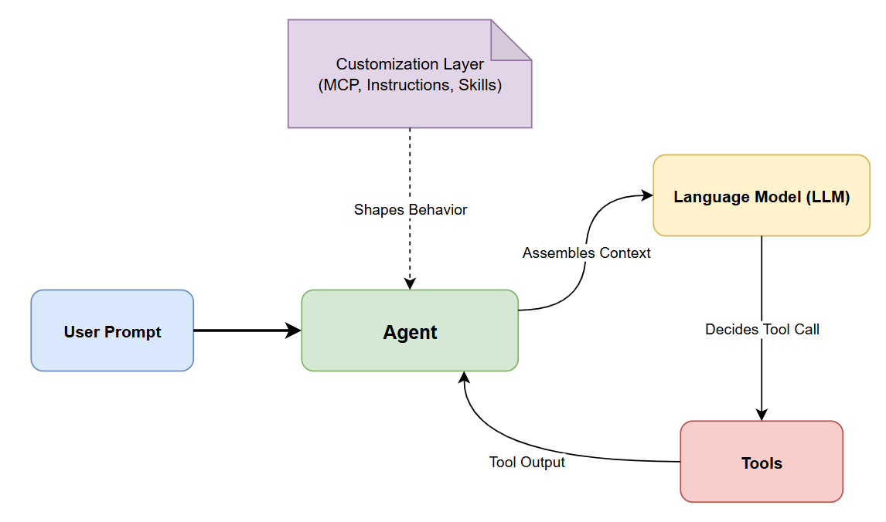

# Concepts

Understanding the core concepts behind GitHub Copilot helps you use it more effectively. This section covers the foundational ideas that power AI-assisted development in VS Code.

## What You'll Learn

- **[Language Models](./language-models)** — How LLMs work, what a context window is, and how to choose the right model for your task.
- **[Context](./context)** — How VS Code assembles context for each request, and how to provide the right information.
- **[Tools](./tools)** — The mechanism that lets the model act on your development environment — reading files, running commands, and connecting to external services.
- **[Agents](./agents)** — The orchestration layer that uses LLMs and tools to perform multi-step development tasks autonomously.
- **[Customization](./customization)** — The framework for tailoring AI behavior to your project — instructions, prompts, skills, agents, MCP, hooks, and plugins.

## The Big Picture

1. You send a **prompt** to an **agent** in the Chat view.
2. The agent assembles **context** (files, history, instructions, tool outputs) and sends it to a **language model**.
3. The model reasons about the task and decides which **tools** to call.
4. Tool outputs feed back into the context for the next iteration (the **agent loop**).
5. Your **customizations** (instructions, prompt files, custom agents, MCP servers, hooks) shape every step of this process.

## References

- [VS Code Copilot Documentation](https://code.visualstudio.com/docs/copilot/overview)
- [GitHub Copilot Documentation](https://docs.github.com/en/copilot)
