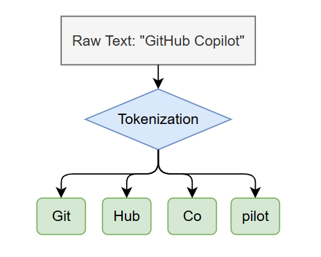

# Language Models

Language models (LLMs) are the AI engines behind GitHub Copilot. They generate text — code, explanations, plans — by predicting the most likely next tokens based on the input they receive.

## Key Concepts

### Context Window

The context window is the total amount of text (measured in tokens) that a model can process in a single request. It includes everything: system instructions, your conversation history, file contents, tool outputs, and custom instructions. Once the window is full, older content gets dropped or summarized.

> **Tip:** Context is a finite resource. Be selective about what you include — more isn't always better.

### Token

A token is the basic unit of text that LLMs process. 

Roughly:

- 1 token ≈ 4 characters in English
- A typical line of code ≈ 10–20 tokens
- A 100-line file ≈ 1,000–2,000 tokens

### Model Selection

Different models produce different results for the same prompt.

| Use Case                                 | Recommended Model Type     | Recommended Models (Mar 2026)                                | Core Rationale                                               |
| :--------------------------------------- | :------------------------- | :----------------------------------------------------------- | :----------------------------------------------------------- |
| **Simple completions, boilerplate code** | **Fast Models**            | **Claude Haiku 4.5** **GPT-5.4 mini** **Gemini 3 Flash** | Extremely fast response times and ultra-low API costs, designed specifically for high-throughput, low-cost tasks. |
| **Complex reasoning, planning**          | **Reasoning Models**       | **Claude Opus 4.6** **GPT-5.4** **Gemini 3.1 Pro**     | Top scores on reasoning benchmarks like SWE-bench and GPQA, equipped with "extended thinking" or "dynamic compute allocation" capabilities. |
| **Architectural decisions**              | **Latest Flagship Models** | **Claude Opus 4.6** **GPT-5.4** **Gemini 3.1 Pro**     | The highest level of comprehensive intelligence, long context windows (typically supporting 1M tokens), and deep analytical capabilities, ideal for critical decisions requiring broad knowledge and deep judgment. |

There is no single "best" model, only the "right" model for a specific task.

- **Default for daily development**: **Claude Sonnet 4.6** (Offers the best balance of code quality, reasoning, and cost).
- **For extremely tough bugs or major refactors**: Upgrade to **Claude Opus 4.6** or **GPT-5.4**.
- **For high-volume, simple requests (cost-sensitive)**: Use **Claude Haiku 4.5** or **Gemini 3 Flash**.

**Adjust thinking effort** for reasoning models using the thinking effort control in the model picker.

### BYOK (Bring Your Own Key)

You can use your own API keys for additional model choices and hosting options beyond what's included with Copilot.

## How VS Code Uses Models

1. You select a model in the **model picker** at the top of the Chat view.
2. The agent assembles [context](./context) and sends it to the selected model.
3. The model generates a response, which may include [tool](./tools) calls.
4. Tool outputs are fed back to the model for the next iteration.

## Model comparison

Before making our final technical selection, we can checking the following two independent benchmarking websites for the latest benchmark data and price comparisons:

1. **[LM Council Benchmarks](https://lmcouncil.ai/benchmarks)**: The world's most-followed, independently run AI benchmark curation.
2. **[Artificial Analysis](https://artificialanalysis.ai/)**: Intuitive side-by-side comparisons of model intelligence, response speed, and API costs.

## References

- [Selecting AI models in VS Code](https://code.visualstudio.com/docs/copilot/customization/language-models)
- [Available models for Copilot Chat](https://docs.github.com/en/copilot/using-github-copilot/ai-models/changing-the-ai-model-for-copilot-chat)
