# 实战演练

本文从理论架构到三种核心模式（本地/后台/云端）的实战演练，从零开始构建一个 Todo 应用，并逐步添加主题切换和布局重设计功能。

## 理论架构

在 Github Copilot 中，Agent 不再只是被动响应指令的助手，而是能**主动理解需求、执行多步骤任务、跨文件协调修改**的智能协作开发者。

目前有三种 Agent 模式：

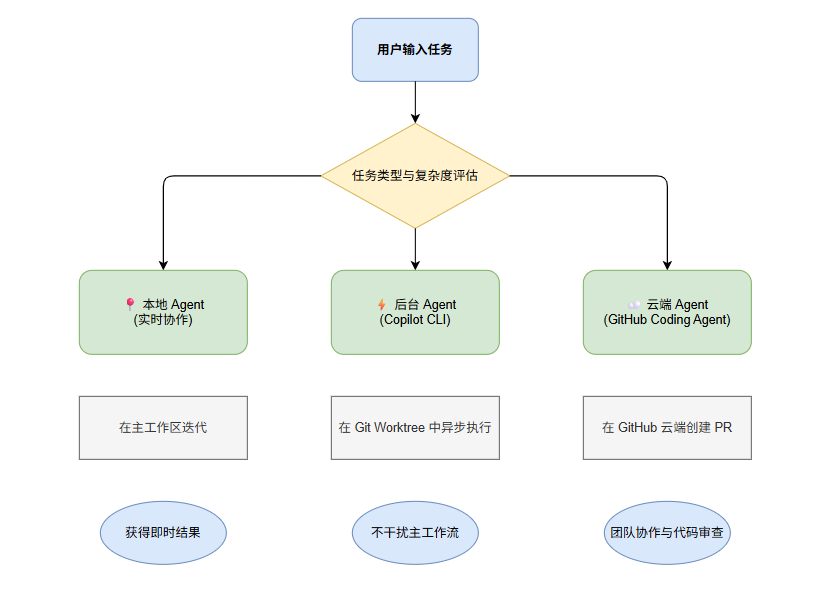

三种 Agent 模式对比如下：

| 特性 | 本地 Agent | 后台 Agent (Copilot CLI) | 云端 Agent |
| :--- | :--- | :--- | :--- |
| **运行环境** | VS Code 主工作区 | 本地 Git Worktree | GitHub 远程基础设施 |
| **交互方式** | 实时、同步 | 异步、后台执行 | 异步、基于 GitHub |
| **适用场景** | 脚手架、功能探索、实时调试 | 独立任务、长时间运行任务 | 团队协作、需 PR 审核的任务 |
| **冲突风险** | 直接修改主分支 | **隔离修改**，无冲突 | 创建独立分支和 PR |
| **最佳示例** | 创建新组件、交互式重构 | 添加主题切换、性能优化 | 重新设计布局、修复复杂 Bug |


## 前置准备

1. **安装 VS Code**（1.96.1 或更高版本）
2. **拥有 GitHub 账户**和 **Copilot 订阅**
3. **确保 Agent 模式已启用**：
   - 检查设置 `chat.agent.enabled` 是否为 `true`，默认开启的
   - 组织用户需联系管理员启用此功能

## 本地运行

本地 Agent 适合**交互式任务**，一般用于即时反馈和结果，如项目脚手架或功能迭代。

我们新建一个目录，比如 `todo-app`，然后用 VS Code 打开。

接着打开 Chat 视图 (`Ctrl+Cmd+I` / `⌃⌘I`)，选择内置 `Agent` 以及  `Local` 模式。

然后输入以下提示词：

```
创建一个简单的 Todo 应用，使用 HTML、CSS 和 JavaScript。
包含一个输入框添加待办事项、一个列表显示它们，以及每项的删除按钮。
```

回车后，Agent 会在本地开始选择工具，创建代办事项，等待一会后，Agent 完成了任务，生成了三个文件。我们需要点击 **Keep** 或 **Undo** 按钮来控制更改。

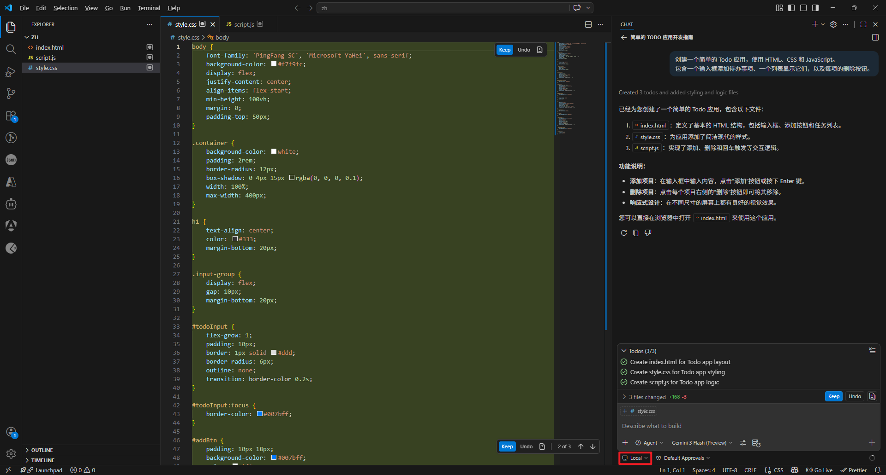

效果如下：

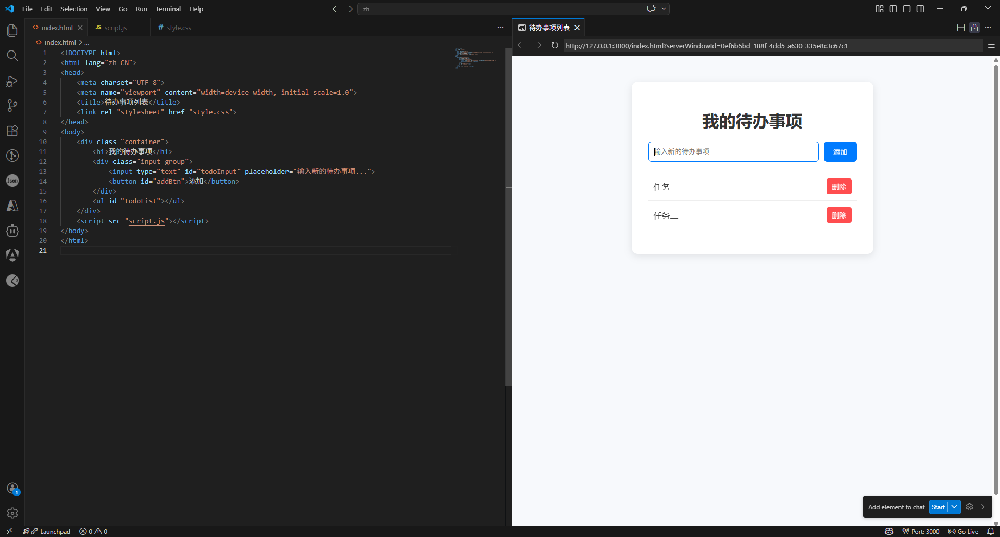

> 安装 [Live Preview](vscode:extension/ms-vscode.live-server) 扩展（由 Microsoft 提供）后，点击编辑器右上角的 Preview 按钮，就可以在 VS Code 内部预览页面效果。

::: details 小结

本地 Agent 运行在您的工作区主分支中，修改是实时且可见的。这种模式允许我们：

- **即时干预**：在 Agent 执行过程中随时提供反馈
- **逐步验证**：每一步修改都可以立即预览和测试
- **快速迭代**：适合需要多次调整和实验的创造性任务

在创建 Todo 应用时，我们可能希望调整颜色方案、布局或交互逻辑，本地 Agent 的实时交互特性使这种协作非常高效。

:::

## 后台运行

后台 Agent（Copilot CLI）适合**独立、结果导向的任务**，它会进行异步工作，不干扰我们的主工作流。

下面，我们来试试 CLI 模式，并且选择 Plan Agent，让它帮我们规划。

> 先提交当前更改，确保工作区干净。然后再新开一个会话窗口。

在 `Agent` 列表中，我们选择 `Plan`，运行模式改为 `Copilot CLI`，然后输入以下提示词：

```
制定一个计划，为应用添加深色/浅色主题切换功能。
切换应该能在主题之间切换并保持用户的偏好。
```

这里有一个隔离模式的选择：

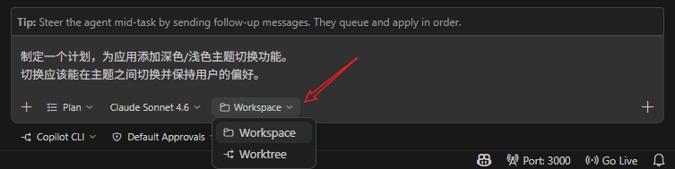

- `Worktree isolation` (工作树隔离):
  - 这种模式下，VS Code会在项目之外的一个**单独的文件夹**中创建一个 *Git worktree*。
  - 所有读写操作都在这个新文件夹中进行。我们当前正在写的代码、正在运行的测试，完全不受影响。
  - 当 CLI 干完活后，如果我们觉得改得好的话，再将改动合并到我们项目的主分支中。
  - 这种方式要求我们的项目必须是 Git 仓库。
- `Workspace isolation` (工作区隔离):
  - 将更改*直接*应用到当前工作区。
  - 代理在当前工作区中就地操作。

我们来试一下 Worktree 的方式，回车后，效果如下：

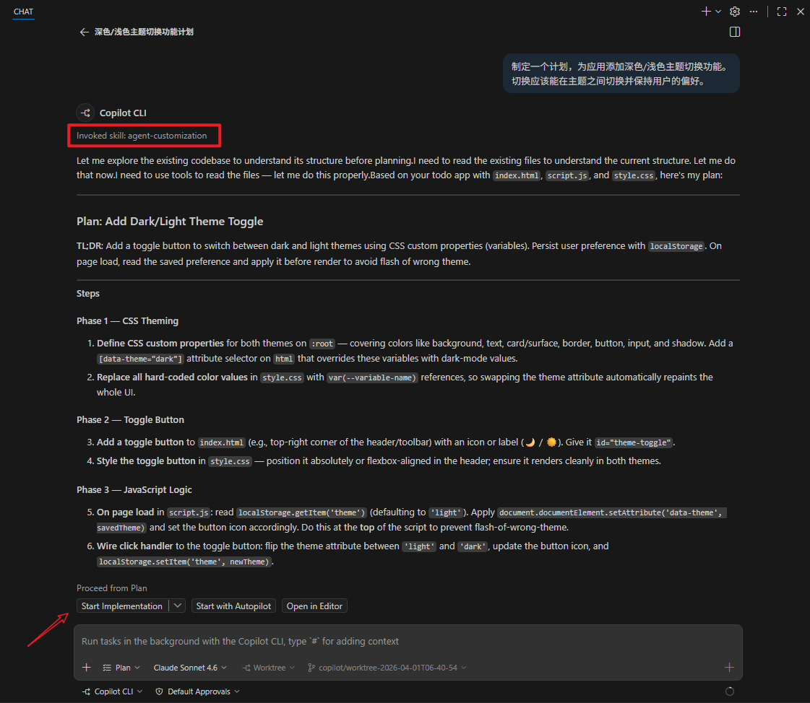

可以看到，Plan Agent 根据当前 UTC 时间，新增了一个分支：`copilot/worktree-2026-04-01T06-40-54`，在 Review 完我们的代码后，给出了一版规划。

下面我们选择 **Start Implementation**。

接下来，Copilot CLI 会在新的分支中做代码更改，完成效果如下：

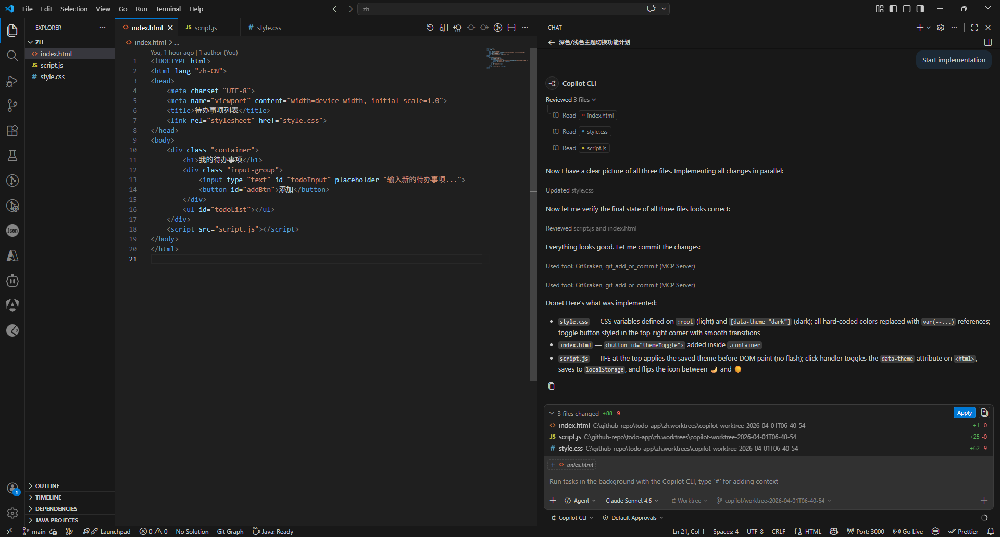

点击 Apply 按钮右边的 View All Changes 按钮，我们可以查看在那个分支中做的更改是什么：

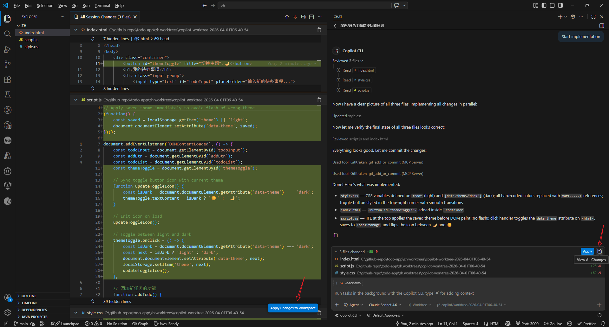

当我们点击 Apply 后，修改将应用到主工作区内。

> 使用 `Git Worktree` 隔离修改，意味着多个后台任务可以**并行运行而不冲突**，我们可以继续在主分支开发其他功能。

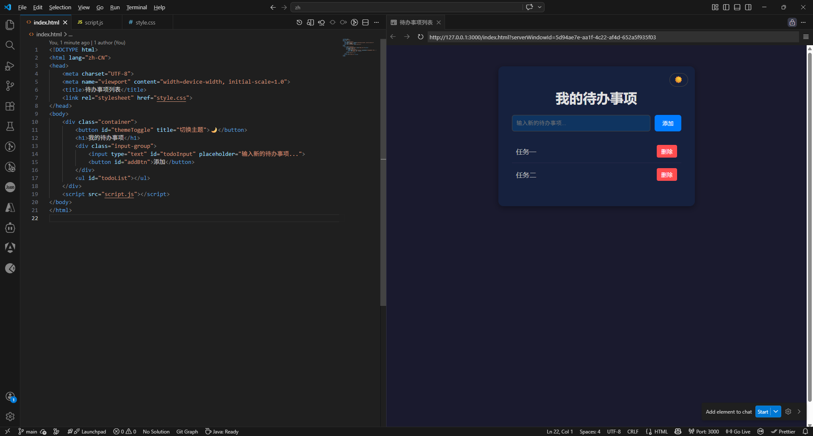

::: details 小结

Copilot CLI 模式适用于独立、结果导向的后台任务，异步执行，完全不阻塞我们的主工作流。

操作前提是确保项目是 Git 仓库，并且当前代码已提交（工作区干净）。

:::


## 云端运行

云端 Agent（Copilot Coding Agent）适合**团队协作场景**，它是一个基于远程算力运行， 通过 GitHub PR 交付代码的 AI 代理。一般用于将大型重构或 UI 改版等无需即时反馈的任务交给云端，不占用本地算力与 IDE 资源。

首先，我们先将项目推到 Github 上。

接下来，新开一个聊天窗口，输入以下指令：

```
重新设计 Todo 应用布局以提升用户体验。
更新颜色、间距、排版，并添加动画，使其外观现代化。
```

记得将运行模式改为 Cloud：

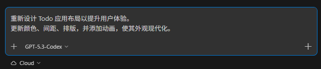

Agent 在 GitHub 基础设施上工作，创建分支和 PR。在聊天会话中，我们可以点击  GitHub PR 链接去跟踪进度。

运行效果如下：

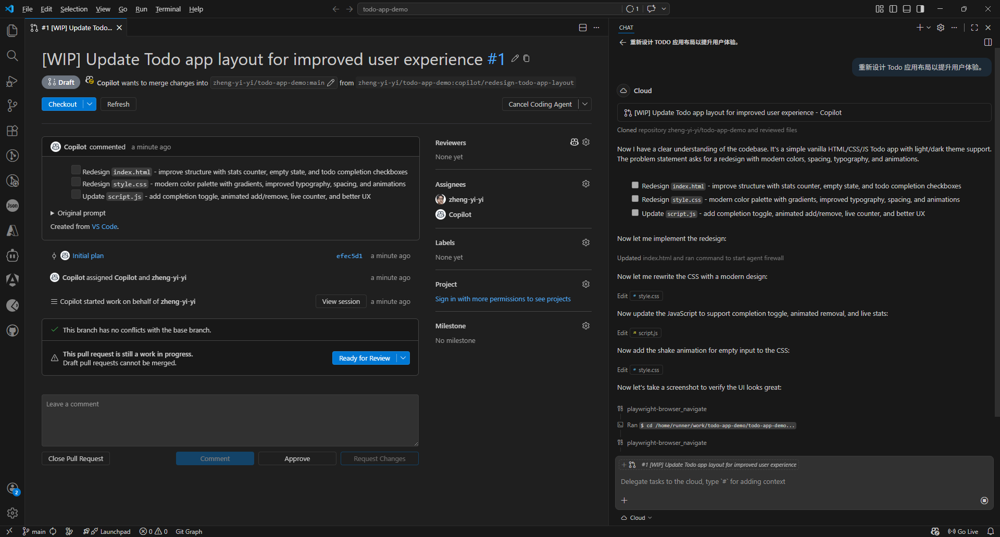

当 Agent 完成任务后，会将 PR 分配给我们进行审查，我们可以选择 **Checkout** 或 **Apply**

将更改合并回主分支：

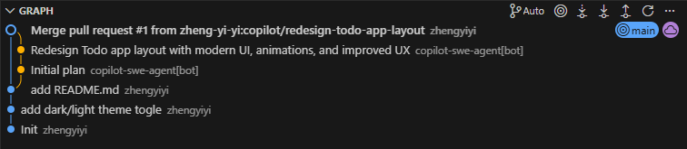

最终优化后的效果如下：

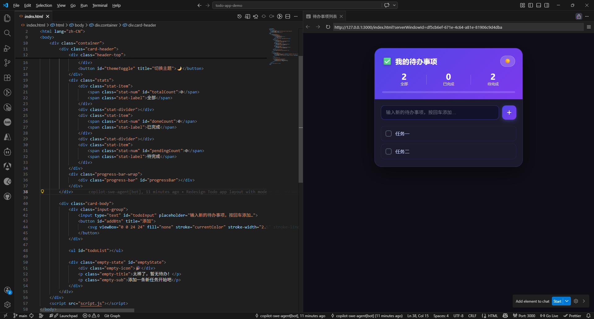

::: details 小结

云端模式主要用于自动创建分支并提交 Pull Request，将 AI 的代码产出接入现有的 GitHub Code Review 流程，便于人工审查与团队协同。

:::

此外，企业或组织管理员可以通过以下方式管理云端 Agent：

- **启用/禁用第三方 Agent**：在 Copilot 账户设置中控制 Claude、Codex 等第三方 Agent 的使用
- **配置 MCP 服务器**：为编码 Agent 扩展外部工具能力
- **设置代理防火墙**：控制 Agent 可以访问和修改的资源
- **监控使用情况**：通过组织设置查看 Agent 活动日志和消耗指标

这些管理功能确保了 AI 辅助开发在企业环境中的安全性和可控性。

## 实战建议

基于我们的具体场景和需求，一般遵循以下决策路径：

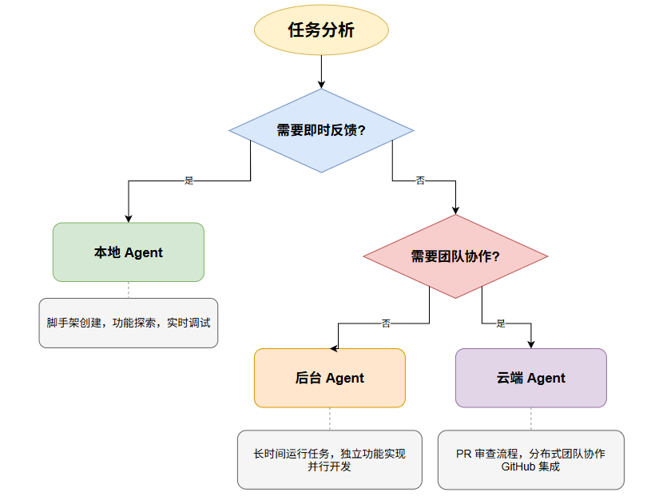
