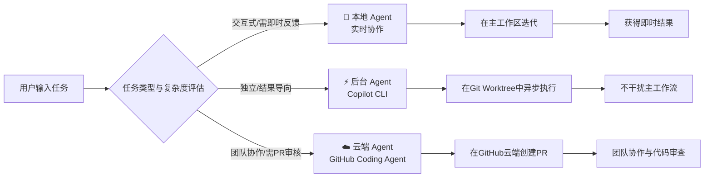
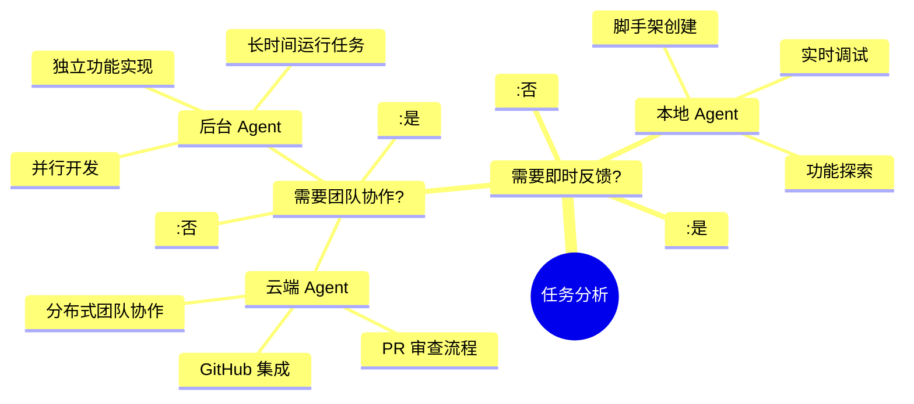

# 开始使用 Agent

本文从理论架构到三种核心模式（本地/后台/云端）的实战演练等，帮助你更快了解 Github Copilot 的实用方式。

## 概述

在 Github Copilot 中，Agent 不再只是被动响应指令的助手，而是能**主动理解需求、执行多步骤任务、跨文件协调修改**的智能协作开发者，其核心采用经典的 **Planner-Executor（规划器-执行器）架构**：Plan Agent 负责理解需求并制定实现方案，Implementation Agent 则根据计划执行具体代码修改。



三种 Agent 模式对比如下：

| 特性 | 本地 Agent | 后台 Agent (Copilot CLI) | 云端 Agent |
| :--- | :--- | :--- | :--- |
| **运行环境** | VS Code 主工作区 | 本地 Git Worktree | GitHub 远程基础设施 |
| **交互方式** | 实时、同步 | 异步、后台执行 | 异步、基于 GitHub |
| **适用场景** | 脚手架、功能探索、实时调试 | 独立任务、长时间运行任务 | 团队协作、需 PR 审核的任务 |
| **冲突风险** | 直接修改主分支 | **隔离修改**，无冲突 | 创建独立分支和 PR |
| **最佳示例** | 创建新组件、交互式重构 | 添加主题切换、性能优化 | 重新设计布局、修复复杂 Bug |


## 实战演练：从零构建 Todo 应用

> 💡 下面将带领您使用不同类型的 Agent，从零开始构建一个 Todo 应用，并逐步添加主题切换和布局重设计功能。

### 前置准备

1. **安装 VS Code**（1.96.1 或更高版本）
2. **拥有 GitHub 账户**和 **Copilot 订阅**
3. **确保 Agent 模式已启用**：
   - 检查设置 `chat.agent.enabled` 是否为 `true`
   - 组织用户需联系管理员启用此功能

### 本地 Agent

本地 Agent 适合**交互式任务**，一般用于即时反馈和结果，如项目脚手架或功能迭代。

我们新建一个目录，比如 `todo-app`，然后用 VS Code 打开。

接着打开 Chat 视图 (`Ctrl+Cmd+I` / `⌃⌘I`)，选择内置 `Agent` 以及  `Local` 模式。

然后输入以下提示词：

```
创建一个简单的 Todo 应用，使用 HTML、CSS 和 JavaScript。
包含一个输入框添加待办事项、一个列表显示它们，以及每项的删除按钮。
```

1. **审查并接受更改**：Agent 会生成多个文件，使用 **Keep** 或 **Undo** 按钮控制更改
2. **预览应用**：配置 `workbench.browser.openLocalhostLinks` 后，使用内置浏览器预览 `index.html`
3. **迭代增强**：发送后续提示，如“添加待办事项完成时的删除线效果”

<details>
<summary>📖 深度解析：为什么本地 Agent 适合脚手架？</summary>

本地 Agent 运行在您的工作区主分支中，修改是实时且可见的。这种模式允许您：
- **即时干预**：在 Agent 执行过程中随时提供反馈
- **逐步验证**：每一步修改都可以立即预览和测试
- **快速迭代**：适合需要多次调整和实验的创造性任务

在创建 Todo 应用时，您可能希望调整颜色方案、布局或交互逻辑，本地 Agent 的实时交互特性使这种协作非常高效。
</details>

### 步骤 2：使用 Copilot CLI 后台实现功能规划

后台 Agent（Copilot CLI）适合**独立、结果导向的任务**，它会在 **Git Worktree** 中异步工作，不干扰您的主工作流。

1. **提交当前更改**，确保工作区干净
2. 在 Chat 视图中选择 **New Chat (+)** 开始新会话
3. 从 **Agents 下拉菜单**中选择 **Plan**
4. 输入规划提示：
   ```
   制定一个计划，为应用添加深色/浅色主题切换功能。
   切换应该能在主题之间切换并保持用户的偏好。
   ```
5. **回答澄清问题**：Plan Agent 可能会询问具体实现细节
6. **开始实施**：选择 **Start Implementation > Continue in Copilot CLI**
7. **Copilot CLI 创建 Worktree**：系统会询问是否复制当前更改，选择 **Copy Changes**
8. **后台执行**：Agent 在 Worktree 中异步工作，您可以在 **Sessions 视图**跟踪进度
9. **应用更改**：完成后，在 Chat 视图选择 **Apply** 将修改合并到主工作区

> 💡 **关键优势**：使用 Git Worktree 隔离修改，意味着多个后台任务可以**并行运行而不冲突**，您同时可以继续在主分支开发其他功能。

### 步骤 3：使用云端 Agent 协作重设计

云端 Agent（Copilot Coding Agent）适合**团队协作场景**，它会在 GitHub 上创建分支和 Pull Request。

1. **发布项目到 GitHub**：
   - 使用 **Publish to GitHub** 命令创建仓库
   - 使用 **Git: Add Remote** 命令添加远程仓库
2. 在 Chat 视图中选择 **New Chat (+)** 开始新会话
3. 从 **Session Type 下拉菜单**中选择 **Cloud**
4. 输入重设计提示：
   ```
   重新设计 Todo 应用布局以提升用户体验。
   更新颜色、间距、排版，并添加动画，使其外观现代化。
   ```
5. **云端执行**：Agent 在 GitHub 基础设施上工作，创建分支和 PR
6. **跟踪进度**：在 **Sessions 视图**或直接通过 GitHub PR 链接查看
7. **审查与合并**：完成后，Agent 会将 PR 分配给您审查。右键会话可选择 **Checkout** 或 **Apply**

<details>
<summary>⚙️ 高级配置：云端 Agent 的组织级管理</summary>

企业或组织管理员可以通过以下方式管理云端 Agent：
- **启用/禁用第三方 Agent**：在 Copilot 账户设置中控制 Claude、Codex 等第三方 Agent 的使用
- **配置 MCP 服务器**：为编码 Agent 扩展外部工具能力
- **设置代理防火墙**：控制 Agent 可以访问和修改的资源
- **监控使用情况**：通过组织设置查看 Agent 活动日志和消耗指标

这些管理功能确保了 AI 辅助开发在企业环境中的安全性和可控性。
</details>

## 🎯 四、进阶技巧与最佳实践

### 1. 上下文工程：让 Copilot 更懂你

上下文工程是提示工程的演进，它关注**如何为 LLM 提供正确的信息**。以下是三种核心方法：

| 方法 | 实现方式 | 适用场景 |
| :--- | :--- | :--- |
| **自定义指令** | `.github/copilot-instructions.md` | 定义编码规范、语言偏好 |
| **可复用提示** | `.github/prompts/*.prompts.md` | 标准化常用工作流，如代码审查 |
| **自定义 Agent** | `.github/agents/*.md` | 创建面向特定任务的 AI 角色 |

**实践示例**：在项目根目录创建 `.github/copilot-instructions.md`：
```markdown
# 项目编码规范
- 使用 TypeScript 严格模式
- 组件使用函数式组件和 Hooks
- 状态管理使用 Zustand
- 测试框架使用 Vitest
```

### 2. MCP 集成：扩展 Agent 能力边界

模型上下文协议（MCP）是连接 AI 与外部工具的开放标准。通过 MCP，Agent 可以：
- **访问外部数据源**：如数据库、API
- **调用专业工具**：如 Playwright 进行浏览器测试
- **集成第三方服务**：如 Sentry 错误跟踪、Notion 文档

**配置示例**（`.vscode/mcp.json`）：
```json
{
  "servers": {
    "github": {
      "command": "npx",
      "args": ["-y", "@modelcontextprotocol/server-github"],
      "env": {
        "GITHUB_PERSONAL_ACCESS_TOKEN": "${GITHUB_TOKEN}"
      }
    },
    "playwright": {
      "command": "npx",
      "args": ["-y", "@playwright/mcp-server"]
    }
  }
}
```

### 3. 第三方 Agent：Claude 与 Codex

GitHub Copilot 现在支持 Anthropic Claude 和 OpenAI Codex 作为第三方 Agent。这些 Agent 提供了独特的工具链和能力：

| Agent | 核心优势 | 特殊功能 |
| :--- | :--- | :--- |
| **Claude Agent** | 长文本理解、安全审计 | `/memory` 管理持久化上下文、`/security-review` 安全审查 |
| **OpenAI Codex** | 复杂推理、多语言支持 | 本地和云端运行、自有执行沙箱 |

> ⚠️ **注意**：使用第三方 Agent 会消耗 **Premium Requests** 配额（预览期间每个会话仅消耗 1 个）。

## 📈 五、模式选择指南与实战建议

基于您的具体场景和需求，遵循以下决策路径：



### 🎯 场景化推荐

| 开发场景 | 推荐模式 | 关键原因 |
| :--- | :--- | :--- |
| **快速原型开发** | 📍 本地 Agent | 即时反馈，快速迭代 |
| **重构现有代码** | ⚡ 后台 Agent | 隔离修改，不影响主分支 |
| **Bug 修复任务** | ☁️ 云端 Agent | 创建 PR，便于团队审查 |
| **测试生成** | 📍 本地 Agent | 需要即时验证测试结果 |
| **性能优化** | ⚡ 后台 Agent | 可能耗时较长，后台执行不阻塞 |
| **新功能开发** | 📍 本地 + ⚡ 后台 | 本地探索设计，后台实现细节 |
| **安全审计** | Claude Agent | 专用安全审查工具 |

## 🔮 六、未来展望与持续学习

GitHub Copilot 的 Agent 模式正在快速演进，以下趋势值得关注：

1. **Agent 操作系统**：GitHub 正在构建一个“Agent 操作系统”，允许调度不同类型、不同来源的 Agent，按需组合。
2. **更强大的工具链**：MCP 协议持续扩展，支持更多外部工具和服务集成。
3. **企业级治理**：组织级共享 Agent、代理防火墙等企业功能不断完善。
4. **多模态能力**：支持根据设计图生成前端代码等多模态交互。

> 📚 **持续学习资源**：
> - [GitHub Copilot 官方文档](https://docs.github.com/copilot)
> - [VS Code Copilot Agents 教程](https://code.visualstudio.com/docs/copilot/agents/agents-tutorial)
> - [Awesome Copilot 社区模板](https://github.com/github/awesome-copilot)

---

**结语**：GitHub Copilot 的 Agent 模式标志着 AI 辅助编程从“工具”向“伙伴”的转变。通过掌握本地、后台、云端三种模式的使用场景，结合上下文工程和 MCP 扩展，您可以将 Copilot 打造为真正懂您项目、适应您工作流的智能协作伙伴。记住：**最好的 AI 体验不是完全自动化，而是人机协作的透明、可控与高效**。
