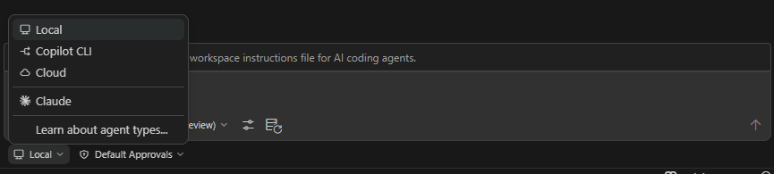

# 智能体

VS Code 中的智能体 Agent 使用语言模型和工具来自主执行开发任务。本节介绍如何有效地使用各种类型的智能体。

## 智能体类型

| 智能体类型 | 运行位置 | 交互性 | 最适用于 |
|---|---|---|---|
| **本地 (Local)** | VS Code 内部 | 高 — 你可以看到每一步 | 交互式编码、快速迭代 |
| **后台 (Copilot CLI)** | 本地机器，VS Code 外部 | 低 — 自主运行 | 范畴明确的任务、并行工作 |
| **云端 (Cloud)** | 远程基础设施 | 异步 | 团队协作、PR 工作流 |
| **第三方 (Third-party)** | 本地或云端 | 取决于提供商 | 特定 AI 提供商 (Anthropic, OpenAI) |

## 内置本地智能体

- **Agent** — 通用模式，具有完整工具访问权限的多文件编辑
- **Ask** — 只读问答模式，不修改文件
- **Plan** — 在实施前进行结构化规划

## 你将学到

- **[规划 (Planning)](./planning)** — 在编码之前使用 Plan 智能体创建实施方案。
- **[记忆 (Memory)](./memory)** — 智能体如何通过三个记忆作用域在对话中保留上下文。
- **[子智能体 (Subagents)](./subagents)** — 将子任务委派给隔离的智能体以进行专注工作。
- **[Copilot CLI](./copilot-cli)** — 在本地机器上自主运行后台会话。
- **[云端智能体 (Cloud Agents)](./cloud-agents)** — 通过拉取请求使用云端智能体进行团队协作。
- **[第三方智能体 (Third-party Agents)](./third-party-agents)** — 使用来自 Anthropic (Claude) 和 OpenAI 等提供商的专门智能体。

## 选择正确的智能体类型

- 针对需要快速迭代并实时查看更改的**交互式工作**，使用**本地智能体**。
- 当任务足够明确，不需要监控每一步时，**将其交给后台智能体**。
- 针对**团队协作**，当你希望以拉取请求的形式获得结果时，使用**云端智能体**。
- 针对本地、后台和云端环境中的独立任务，**运行并行会话**。
- **在类型之间进行切换** — 从本地开始探索和规划，然后交给后台实施。

## 参考资料

- [智能体概览](https://code.visualstudio.com/docs/copilot/agents/overview)
- [智能体概念](https://code.visualstudio.com/docs/copilot/concepts/agents)
- [智能体教程](https://code.visualstudio.com/docs/copilot/agents/agents-tutorial)
