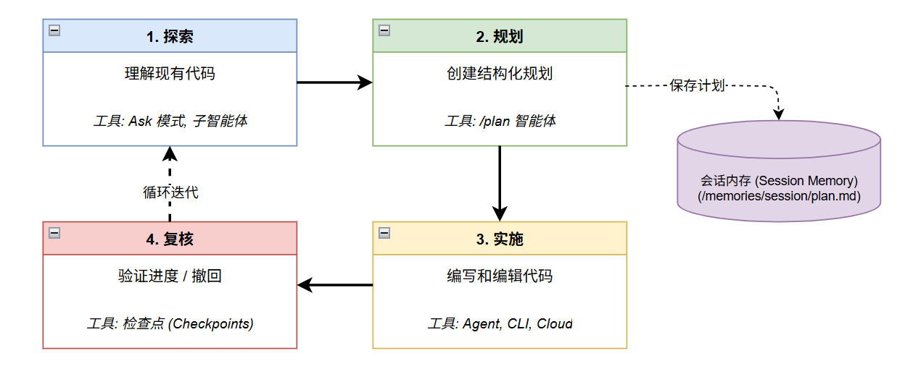

# 规划

Plan 智能体使你能够在编写代码之前创建详细的实施方案。规划优先可以确保满足所有需求，并防止 AI 解决错误的问题。

## 规划优先的工作流



## 如何使用 Plan 智能体

1. 打开聊天视图 (<kbd>Ctrl+Alt+I</kbd>)，从智能体下拉列表中选择 **Plan**。
2. 从高层描述你的任务：

```
/plan 使用 OAuth2 和 JWT 实现用户身份验证系统
```

3. 回答智能体在研究后提出的任何澄清问题。
4. 审查生成的方案 — 它包括高级概述、实施步骤和验证步骤。
5. 通过后续提示词进行迭代，直到方案满足你的需求。
6. 开始实施或交给 Copilot CLI / 云端智能体。

::: tip
你也可以在聊天中输入 `/plan` 加任务描述来一步切换到 Plan 智能体。
:::

## 实施交接

方案最终确定后，你可以：

- **在同一会话中继续** — Agent 直接实施方案
- **交给 Copilot CLI** — 选择 "Continue in Copilot CLI" 进行后台执行
- **交给云端** — 选择 "Continue in Cloud" 进行基于 PR 的工作流

## 会话记忆

Plan 智能体会自动将其方案保存到会话记忆文件 (`/memories/session/plan.md`)。

通过 `Chat: Show Memory Files` 访问。

会话记忆在对话结束时清除。

## 自定义规划

- **创建自定义规划智能体** — 定义一个 `.agent.md` 并加入特定规划指令（如强制执行架构指南）。
- **选择模型** — 使用 `chat.planAgent.defaultModel` 设置 Plan 智能体的模型，使用 `github.copilot.chat.implementAgent.model` 设置实施模型。
- **添加额外工具** — 使用 `github.copilot.chat.planAgent.additionalTools` 为 Plan 智能体添加 MCP 服务器或其他工具的访问权限。

## 参考资料

- [使用智能体进行规划](https://code.visualstudio.com/docs/copilot/agents/planning)
- [上下文工程指南](https://code.visualstudio.com/docs/copilot/guides/context-engineering-guide)
