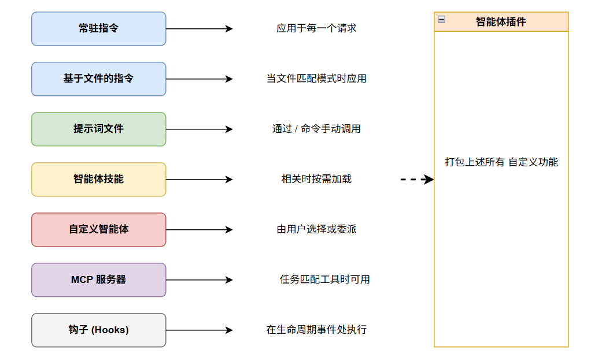

# 定制化

AI 模型具有广泛的通用知识，但不了解你的代码库或团队实践。自定义 (Customization) 就是你分享这些上下文的方式，使响应符合你的编码标准、项目结构和工作流程。

## 自定义选项总览

| 目标 | 机制 | 示例 | 何时生效 |
|---|---|---|---|
| 在所有地方应用编码标准 | **始终生效指令** | 强制执行 ESLint 规则，要求 JSDoc | 每次请求自动应用 |
| 为不同文件设置不同规则 | **基于文件的指令** | 为 `.tsx` 文件设置 React 模式 | 当文件匹配模式时 |
| 反复运行的可重用任务 | **提示词文件** | 搭建 React 组件脚手架 | 当你调用 `/` 命令时 |
| 使用脚本封装多步工作流 | **智能体技能** | 测试、检查和部署流水线 | 当任务匹配技能描述时 |
| 具有工具限制的专门 AI 角色 | **自定义智能体** | 安全审查员、数据库管理员 | 当你选择它时 |
| 连接到外部 API 或数据库 | **MCP 服务器** | 查询 PostgreSQL 数据库 | 当任务匹配某个工具时 |
| 在智能体生命周期节点自动化任务 | **钩子** | 每次编辑后运行格式化工具 | 在匹配的生命周期事件时 |
| 安装预封装的自定义项 | **智能体插件** | 社区测试插件 | 当你安装插件时 |

## 从哪里开始

1. **从自定义指令开始** — 设置项目范围的标准 — 创建 `.github/copilot-instructions.md`
2. **添加提示词文件** — 当你有可重复的任务时 — 创建 `.prompt.md` 文件
3. **使用 MCP** — 当需要外部数据时 — 配置 `mcp.json`
4. **创建自定义智能体** — 为专门的角色 — 创建 `.agent.md` 文件
5. **组合** — 随着需求增长组合使用多种自定义类型

## 它们如何协同工作

## 指令优先级

当存在多种指令类型时，它们都会被提供给 AI。在冲突时优先级较高的生效：

1. **个人指令**（用户级）— 最高优先级
2. **仓库指令**（`.github/copilot-instructions.md` 或 `AGENTS.md`）
3. **组织指令** — 最低优先级

## 详细指南

- [自定义指令](/zh/customization/custom-instructions) — `.github/copilot-instructions.md`、`.instructions.md`、`AGENTS.md`
- [提示词文件](/zh/customization/prompt-files) — `.prompt.md` 可重用任务提示词
- [智能体技能](/zh/customization/agent-skills) — `SKILL.md` 可移植的能力
- [自定义智能体](/zh/customization/custom-agents) — `.agent.md` 专门的角色
- [MCP 服务器](/zh/customization/mcp-servers) — 外部工具和数据源
- [钩子](/zh/customization/hooks) — 生命周期自动化
- [智能体插件](/zh/customization/agent-plugins) — 预封装的捆绑包

## 参考资料

- [自定义概念](https://code.visualstudio.com/docs/copilot/concepts/customization)
- [自定义概览](https://code.visualstudio.com/docs/copilot/customization/overview)
