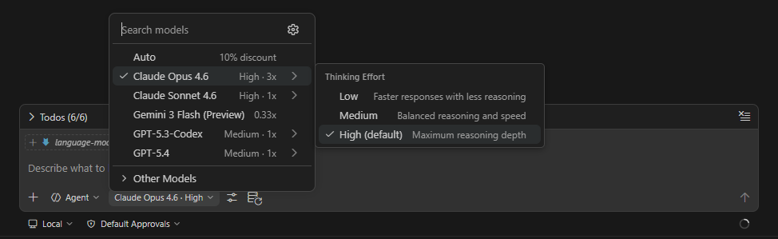

# 大语言模型

大语言模型 (LLM) 是 GitHub Copilot 背后的 AI 引擎。它们通过根据接收到的输入预测最可能的下一个标记 (Token) 来生成文本 —— 包括代码、解释和规划。

## 关键概念

### 上下文窗口

上下文窗口 (Context Window) 是模型在单次请求中可以处理的文本总量（以 Token 衡量）。

上下文窗口包括所有内容：系统指令、对话历史、文件内容、工具输出和自定义指令。

一旦窗口填满，较早的内容将被丢弃或总结。

> **提示：** 上下文是有限的资源。请有选择地包含内容 —— 多并不总是更好。

### 词元

词元 Token 是 LLM 处理文本的基本单位。

大致上：

- 1 Token ≈ 4 个英文单词字符
- 典型的一行代码 ≈ 10–20 个 Token
- 一个 100 行的文件 ≈ 1,000–2,000 个 Token

### 模型选择

对于相同的提示词，不同的模型会产生不同的结果。

不同的模型有不同的优势：

| 使用场景                 | 推荐模型类型     | 推荐模型 (2026年3月)                                         | 核心理由                                                     |
| :----------------------- | :--------------- | :----------------------------------------------------------- | :----------------------------------------------------------- |
| **简单的补全、样板代码** | **快速模型**     | **Claude Haiku 4.5** **GPT-5.4 mini** **Gemini 3 Flash** | 响应速度极快，API成本极低，专为高吞吐量、低成本任务设计。    |
| **复杂的推理、规划**     | **推理模型**     | **Claude Opus 4.6** **GPT-5.4** **Gemini 3.1 Pro**     | 在SWE-bench、GPQA等推理基准上得分顶尖，具备“扩展思考”或“动态计算分配”能力。 |
| **架构决策**             | **最新旗舰模型** | **Claude Opus 4.6** **GPT-5.4** **Gemini 3.1 Pro**     | 综合智能、长上下文（普遍支持1M tokens）和深度分析能力的最高水平，适合需要广博知识和深度判断的关键决策。 |

没有“万能”的最佳模型，只有“最适合特定任务”的模型。

- **日常开发默认首选**：**Claude Sonnet 4.6**（在编码质量、推理能力和成本之间取得了最佳平衡）。
- **遇到极难的Bug或架构重构**：升级到 **Claude Opus 4.6** 或 **GPT-5.4**。
- **需要处理海量简单请求，需要控制成本时**：使用 **Claude Haiku 4.5** 或 **Gemini 3 Flash**。

使用模型选择器中的 "Thinking Effort" 控制项来调整推理深度：

### 自备密钥

你可以使用自己的 API 密钥来获得 Copilot 包含内容之外的更多模型选择和托管选项。

## 模型使用

1. 你在聊天视图顶部的 **模型选择器** 中选择一个模型。
2. 智能体组装 [上下文 (Context)](./context) 并将其发送给选定的模型。
3. 模型生成响应，其中可能包含 [工具 (Tool)](./tools) 调用。
4. 工具输出被反馈给模型，用于下一次迭代。

## 模型对比

在做出最终技术选型前，我们可以查阅以下两个独立评测网站，以获取最新的基准测试数据和价格对比：

1. **[LM Council Benchmarks](https://lmcouncil.ai/benchmarks)**：独立运行的全球最受关注的AI基准测试汇总。
2. **[Artificial Analysis](https://artificialanalysis.ai/)**：提供直观的模型性能、响应速度与API成本的横向对比。

## 参考资料

- [在 VS Code 中选择 AI 模型](https://code.visualstudio.com/docs/copilot/customization/language-models)
- [Copilot Chat 可用模型](https://docs.github.com/en/copilot/using-github-copilot/ai-models/changing-the-ai-model-for-copilot-chat)
