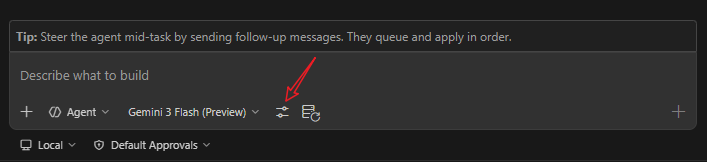

# 工具

工具 (Tools) 是模型操作开发环境的机制。

如果没有工具，语言模型只能生成文本。

有了工具，智能体就可以读取文件、编写代码、运行终端命令、搜索代码库以及连接到外部服务。

## 工具类型

| 类型 | 描述 | 设置方式 |
|---|---|---|
| **内置工具** | 随 VS Code 附带 —— 读取/写入文件、终端、代码库搜索、编辑器导航 | 立即生效 |
| **MCP 工具** | 由 [MCP 服务器](/zh/customization/mcp-servers) 提供 —— 数据库、API、外部服务 | 在 `mcp.json` 中配置 |
| **扩展工具** | 由 VS Code 扩展通过 Language Model Tools API 提供 | 安装对应扩展 |

## 工具如何工作

在 **智能体循环 (Agent Loop)** 期间，模型会检查可用工具并自主决定调用哪一个：

1. 你给智能体一个高阶任务。
2. 模型为每一步选择相关的工具。
3. 每个工具调用产生输出，并成为下一次迭代上下文的一部分。
4. 循环继续，直到任务完成。

你也可以在提示词中使用 `#tool:<tool-name>` 显式引用工具。

## 控制可用工具

使用聊天输入框中的 **配置工具 (Configure Tools)** 按钮来启用/禁用单个工具。

限制工具有助于：

- **保留上下文** — 更少的工具调用意味着消耗更少的上下文
- **获得更相关的结果** — 智能体专注于最合适的工具
- **提高性能** — 较小的工具集减少了模型的决策空间

你还可以通过 [提示词文件](/zh/customization/prompt-files) 和 [自定义智能体](/zh/customization/custom-agents) 来控制工具，它们可以为特定任务定义一组固定的工具。

## 工具审批与信任

工具可以修改文件、你的环境或访问外部服务。

VS Code 提供了安全控制：

- **审批提示** — 具有副作用的工具在运行前会显示确认对话框
- **URL 审批** — 验证网络请求和响应内容的双步流程
- **权限级别** — 控制智能体的自主度，从手动审批到完全自主：
  - **默认审批 (Default Approvals)** — 使用你配置的审批设置
  - **绕过审批 (Bypass Approvals)** — 自动批准所有工具调用
  - **自动驾驶 (Autopilot)** — 自动批准一切并驱动智能体完成任务

## 参考资料

- [工具概念](https://code.visualstudio.com/docs/copilot/concepts/tools)
- [在智能体中使用工具](https://code.visualstudio.com/docs/copilot/agents/agent-tools)
- [添加和管理 MCP 服务器](https://code.visualstudio.com/docs/copilot/customization/mcp-servers)
